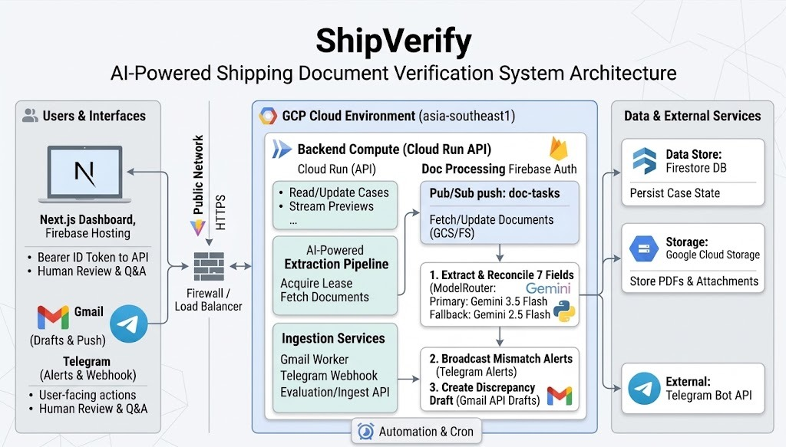

# ShipVerify Platform

> **A production-oriented hackathon prototype with enterprise safety patterns.**

ShipVerify is an intelligent maritime shipping correspondence triage and document reconciliation platform. It ingests high-volume customer emails, classifies correspondence into operational categories, extracts and cross-checks shipping instructions against draft bills of lading across a strict 7-field verified contract, and orchestrates human-in-the-loop review with automated Gmail draft replies.

---

## System Architecture



### Core Architecture Components

1. **Ingestion State Machine**:
   - Resumable pipeline transitioning through `PENDING` → `DOCUMENTS_STORED` → `TASK_PUBLISHED`.
   - Content-addressed document storage (`sha256:<hash>`) eliminates redundant uploads during network interruptions.
   - Prevents race conditions: tasks are published to Pub/Sub only after 100% of attachments are confirmed in Google Cloud Storage.
   - Immutable email cases reject altered attachment payloads; append-mode unions additional documents safely.

2. **Loss-Safe Gmail Synchronization**:
   - Full cursor pagination across `history.list` and `messages.list`.
   - History cursors (`history_id`) advance only after all messages in a synchronization batch are successfully processed.
   - Automatic cursor recovery: HTTP 404/410 cursor expiration triggers a 30-day paginated reconciliation window.
   - Transient failures (429 rate limits, 5xx server errors, network timeouts) are raised to Pub/Sub for retry without corrupting the confirmed cursor.
   - Watch renewals reconcile recent messages before persisting renewed expiration timestamps.

3. **Processing Worker**:
   - Private Cloud Run service receiving Pub/Sub push subscriptions.
   - Distributed leasing (`processing_lease_seconds`) with terminal-state checks ensures exactly-once execution semantics despite Pub/Sub duplicate deliveries.
   - Gemini multimodal reasoning extracts and cross-checks shipping documents against operational business rules.

4. **Canonical API Service**:
   - Cloud Run backend exposing public REST contracts (`/healthz`, `/api/dashboard`, `/api/inbox`, `/api/cases`, `/api/reviews`, `/api/settings`, `/api/knowledge-base`).
   - Authenticated with Firebase ID tokens (`Authorization: Bearer <Firebase ID token>`), validated against Google Cloud Project audience and reviewer records.
   - Optimistic concurrency control (`version` check with HTTP 409 Conflict) prevents concurrent reviewer overwrites.

5. **Live Next.js Operations Dashboard**:
   - Built with Next.js 15 App Router and deployed as a static export (`output: "export"`) via Firebase Hosting.
   - Real-time 15-second polling on active views with automatic tab-visibility pausing and abort-controller cancellation.
   - Fully source-backed: all tables, metrics, period filters, and inspection panels display live Firestore data.

6. **Isolated Evaluation Adapter**:
   - The legacy benchmark classifier is completely quarantined inside `backend/evaluation_adapter/`.
   - Production services never import or expose evaluator endpoints (`/health`, `/api/classify`).

---

## The 7-Field Verified Contract

Discrepancy detection between **Shipping Instructions (SI)** and draft **Bills of Lading (BL)** strictly extracts and verifies exactly seven operational fields:

| Field Key | Display Name | Validation Scope |
| :--- | :--- | :--- |
| `shipper` | Shipper | Corporate name, registered address, contact details |
| `consignee` | Consignee | Receiver name, physical delivery address, destination contact |
| `notify_party` | Notify Party | Cargo arrival notice recipient or "SAME AS CONSIGNEE" |
| `port_of_loading` | Port of Loading (POL) | Origin port name and UN/LOCODE (e.g., `MYPKG - Port Klang`) |
| `port_of_discharge` | Port of Discharge (POD) | Destination port name and UN/LOCODE (e.g., `SGSIN - Singapore`) |
| `container_count` | Container Count | Total quantity of containers (e.g., `2 x 40' HC`) |
| `gross_weight` | Gross Weight | Cargo weight with metric unit specification (e.g., `28,450.00 KGS`) |

> [!IMPORTANT]
> **Vessel and Voyage Status**:
> Vessel name and voyage number are treated strictly as **unverified email context** and are never evaluated as document discrepancy fields. Ocean carriers frequently alter feeder vessel feeder legs and voyage codes during initial booking stages; flagging these shifts as document defects causes operational false-alarms.

### Production Categories

- `BL_COMPARISON`: Correspondence containing draft Bill of Lading and Shipping Instruction documents for discrepancy verification.
- `SI_REQUEST`: New shipping instruction submissions or booking filing requests.
- `INVOICE_QUERY`: Freight bills, demurrage charges, payment confirmations, and billing disputes.
- `GENERAL`: Port operational advisories, sailing schedule queries, and general support.
- `SPAM`: Unsolicited commercial solicitations and non-operational traffic.

*(Note: Legacy categories `DOCUMENT_COMPARISON` and `NEW_SI_REQUEST` are isolated to `backend/evaluation_adapter` for test benchmark harness compliance).*

---

## Operational Safety & Governance Policies

### Dynamic & Immutable Platform Settings
Stored in Firestore at `platform_settings/current`:
- **Mutable Settings**:
  - `confidence_threshold` (Default: `0.85`, Range: `0.50` - `0.99`): Threshold below which field extractions are flagged for human review.
  - `mismatch_alerts_enabled` (Default: `true`): Toggles real-time alerts to Telegram while preserving dashboard review queues.
- **Fixed Enterprise Safeguards**:
  - `low_confidence_requires_review`: Fixed `true` — values under confidence threshold always require reviewer sign-off.
  - `missing_value_requires_review`: Fixed `true` — any missing required contract field triggers human verification.
  - `unreadable_requires_review`: Fixed `true` — corrupted, password-protected, or unparseable attachments automatically route to review.

### Knowledge Base
- Weekly knowledge bases aggregate operational exceptions and patterns by ISO week (e.g., `2026-W38`).
- Weekly summaries and governed assumptions are stored in the application knowledge base and surfaced in the authenticated dashboard.

### Document Comparison & Field Review

- Review, Inbox, and Verification Cases share a document comparison workspace. Each pane can show the original PDF or extracted text independently.
- `GET /api/cases/{case_id}/documents/{document_id}/content` serves original bytes behind reviewer authentication. PDF responses include an actual `X-Document-Page-Count` when readable; other file types are served as downloads. Responses are private and uncached.
- `PUT /api/cases/{case_id}/fields/{field}/review` accepts `decision` (`confirm`, `correct`, or `unreadable`), `expected_version`, `document_role` (`SI` or `BL`), optional correction `value`, and `note`. Use public field names, including `gross_weight`.
- Decisions retain the original machine values, reviewer identity, UTC timestamp, effective human values, and append-only review history. Saving a field does not approve or decline the case, create a Gmail draft, or send a reply.
- Missing or unreadable fields remain unresolved. Final approval of a case with structured decisions is blocked while required fields remain unresolved. Retrying extraction clears current decisions while retaining their history.
- Run the focused server checks with `uv run pytest tests/test_field_review.py tests/test_platform_api.py tests/test_draft_workflow.py -q`, and the frontend checks with `npm test --prefix frontend`, `npm run typecheck --prefix frontend`, and `npm run lint --prefix frontend`.

For acceptance testing, compare two multi-page PDFs, switch only one pane to text, verify page and zoom retention, review multiple flagged fields, reload a saved correction, and test a stale decision from a second reviewer. Check the same workflow at narrow widths and with keyboard navigation. Operational review-time savings and missed-discrepancy rates need a measured reviewer trial; automated checks do not establish those outcomes.

---

## Environment Setup & Configuration

### Prerequisites
- **Python**: 3.12 or higher with [`uv`](https://docs.astral.sh/uv/) package manager
- **Node.js**: 20.x or higher with `npm`
- **Docker**: Docker Desktop or engine for container builds
- **Google Cloud SDK**: `gcloud` CLI configured with an active GCP project
- **Firebase CLI**: `firebase-tools` for hosting deployments

### Secret Management
ShipVerify separates mandatory core secrets from optional integration secrets:

#### Mandatory Core Secrets (GCP Secret Manager)
- `grader-ingest-key`: Pre-shared secret key for automated ingestion endpoints.
- `app-signing-secret`: Cryptographic key used to HMAC-sign and verify OAuth state tokens.
- `gmail-oauth-client-json`: Google Cloud OAuth 2.0 Web Client credential JSON.
- `gmail-address`: Dedicated operational mailbox address.

#### Optional Integration Secrets
- `telegram-bot-token`: Bot token for operator notifications.
- `telegram-webhook-secret`: Webhook authentication token for incoming Telegram messages.
- `telegram-admin-chat-id`: Telegram chat ID for administrative alert broadcasts.

### Frontend Environment Variables
Set in `frontend/.env.local` for development or exported in CI/CD:
```bash
NEXT_PUBLIC_API_URL="http://127.0.0.1:8080"
NEXT_PUBLIC_FIREBASE_API_KEY="AIzaSy..."
NEXT_PUBLIC_FIREBASE_AUTH_DOMAIN="your-project.firebaseapp.com"
NEXT_PUBLIC_FIREBASE_PROJECT_ID="your-project"
NEXT_PUBLIC_FIREBASE_APP_ID="1:...:web:..."
```

---

## Local Development Commands

### 1. Recreate the Local Dataset
The generated 520-email synthetic corpus is excluded from git. Recreate it deterministically:
```bash
python data/generate.py --seed 42 --n 500 --out data
```

### 2. Backend Verification
```bash
# Run the complete Python test suite (75 tests)
uv run pytest -q

# Run Python linting and code style checks
uv run ruff check .
```

### 3. Frontend Verification
```bash
# Run Vitest unit tests
npm test --prefix frontend

# Run ESLint validation
npm run lint --prefix frontend

# Run TypeScript typechecks
npm run typecheck --prefix frontend

# Compile production static export (outputs to frontend/out)
npm run build --prefix frontend
```

### 4. Container Build & Health Verification
```bash
# Build API container image
docker build -f Dockerfile.api -t classall-api:local .

# Build Worker container image
docker build -f Dockerfile.worker -t classall-worker:local .

# Test local execution and verify healthcheck
docker run -d --rm --name test-api -p 18080:8080 -e ENVIRONMENT=test classall-api:local
curl http://localhost:18080/healthz
# Returns: {"status":"ok","service":"classall-api"}
docker stop test-api
```

---

## Firebase Reviewer Authentication Setup

1. **Enable Google Sign-In**:
   - In the [Firebase Console](https://console.firebase.google.com/), navigate to **Authentication** > **Sign-in method**.
   - Enable the **Google** provider and configure the authorized redirect domains.
2. **Authorize Reviewer Accounts**:
   - Create or verify a document in the Firestore `reviewers` collection:
     ```json
     {
       "uid": "<FIREBASE_USER_UID>",
       "email": "reviewer@company.com",
       "role": "reviewer",
       "active": true
     }
     ```
3. **Session Enforcement**:
   - The frontend automatically passes the Google ID token in the `Authorization: Bearer <token>` header.
   - If a 401 Unauthorized status is returned, the client requests a refreshed ID token and retries the request once before redirecting to sign-in.

---

## Deployment & Rollback Strategy

### Cloud Run & Firebase Deployment
Automated end-to-end deployment is orchestrated by [`infra/deploy.sh`](infra/deploy.sh):
```bash
bash infra/deploy.sh
```
This script:
1. Verifies required Secret Manager secrets.
2. Builds API and Worker container images and pushes them to Google Artifact Registry.
3. Deploys `classall-api` and `classall-worker` to Cloud Run with least-privilege service accounts.
4. Injects Firebase Web App configuration, builds the static Next.js export, and deploys `frontend/out` to Firebase Hosting.

### Rollback Procedure
All Firestore document schemas and views are designed to be strictly **additive and backward-compatible**, ensuring zero-downtime rollback without requiring database restoration:
```bash
# 1. Instantly roll back Cloud Run API to previous stable revision
gcloud run services update-traffic classall-api --to-revisions=<PREVIOUS_API_REVISION>=100 --region=asia-southeast1

# 2. Instantly roll back Cloud Run Worker to previous stable revision
gcloud run services update-traffic classall-worker --to-revisions=<PREVIOUS_WORKER_REVISION>=100 --region=asia-southeast1

# 3. Roll back Firebase Hosting release
firebase hosting:rollback --project <PROJECT_ID>
```

---

## Five-Step Hero Demonstration

Experience the complete end-to-end workflow:

```text
Step 1: Ingest Email ──→ Step 2: Automated Triage ──→ Step 3: Reviewer Notification
                                                                      │
Step 5: Safe Gmail Reply ◄── Step 4: Discrepancy Verification ◄───────┘
```

1. **Step 1 — Ingest Incoming Email**:
   - Customer submits an email with attached draft Bill of Lading and Shipping Instructions where the consignee address has a transposed street number.
   - Gmail push notification delivers the event to Pub/Sub; the worker ingests the documents into Cloud Storage and records the case.
2. **Step 2 — Automated Discrepancy Triage**:
   - The worker runs Gemini document analysis across the 7 verified contract fields.
   - The comparison detects the consignee mismatch: `status=MISMATCH`, `has_defect=true`, and `defect_fields=["consignee"]`.
3. **Step 3 — Reviewer Dashboard Alert**:
   - Reviewer logs in via Google Authentication on the live Next.js dashboard.
   - The case appears immediately in the attention queue with the mismatch highlighted in the live badge counter.
4. **Step 4 — Human-in-the-Loop Inspection**:
   - Reviewer opens the case, compares the side-by-side extracted values against the original PDF attachments, and clicks **Decline**.
5. **Step 5 — Safe Gmail Draft Generation & Dispatch**:
   - The platform automatically generates a polite, precise draft reply in Gmail quoting the mismatched consignee details.
   - The reviewer adjusts any notes and clicks **Send Draft**; the API verifies version and content-hash checksums before sending.

---

## Evaluation Benchmark & Scoring

For evaluating the platform against the SDOC Hackathon reference dataset and scoring server, please refer to the dedicated [Evaluation Guide](docs/EVALUATION_GUIDE.md).

> [!NOTE]
> The evaluation runner ([`scripts/eval_inbox.py`](scripts/eval_inbox.py)) relies solely on the isolated [`backend/evaluation_adapter`](backend/evaluation_adapter) package and does not interact with or deploy to the production Cloud Run architecture.
